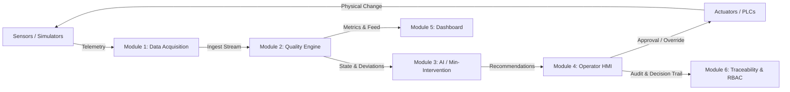

# BatchSaver System Architecture

## Executive Summary

BatchSaver is an AI-assisted real-time quality monitoring and minimum-intervention correction platform engineered specifically for **wet masala manufacturing**. 

Wet masala processing is sensitive to raw material variations, shear-induced heating, moisture evaporation, and continuous mixing dynamics. BatchSaver solves batch degradation by monitoring key physical-chemical attributes in real time, calculating batch health scores, detecting drift early, and recommending the smallest effective corrective action with human-in-the-loop operator confirmation.

---

## High-Level Real-Time Pipeline

The core execution loop is designed around the closed-loop industrial control flow:

---

## Core Monitored Quality Parameters

| Parameter | Target Value | Warning Band | Critical Band (Acceptable) | Engineering Unit | Industrial Sensor Type |
| :--- | :--- | :--- | :--- | :--- | :--- |
| **Viscosity** | `3200 cP` | `±100 cP` | `±150 cP` (`3050 - 3350`) | Centipoise (cP) | Inline rotational/vibrational viscometer |
| **Moisture** | `38.0%` | `±1.0%` | `±1.5%` (`36.5% - 39.5%`) | % w/w | NIR / Microwave moisture sensor |
| **Colour Index** | `62.0` | `±2.0` | `±3.0` (`59.0 - 65.0`) | CI Units | Inline spectrophotometer / RGB vision sensor |
| **Temperature** | `92.0°C` | `±1.5°C` | `±2.0°C` (`90.0°C - 94.0°C`) | °Celsius | RTD PT100 / Thermocouple probe |

---

## Architectural Principles

1. **Decoupled 6-Module Architecture**: Every module is bounded by explicit TypeScript interfaces and contracts.
2. **Industrial Protocol Agnostic**: The ingestion layer abstracts physical hardware through provider interfaces (`ISensorProvider`, `IActuatorProvider`).
3. **Deterministic & Explainable AI First**: Initial corrective algorithms use clear rule matrices and root-cause analysis reason codes before transitioning to statistical machine learning models.
4. **Human-In-The-Loop (HITL) Safety**: No automated corrective actuator command is dispatched without operator review and strict safety limits.
5. **Full Traceability**: All telemetry, quality evaluations, operator decisions, and actuator executions are stored immutably for audit and compliance.
