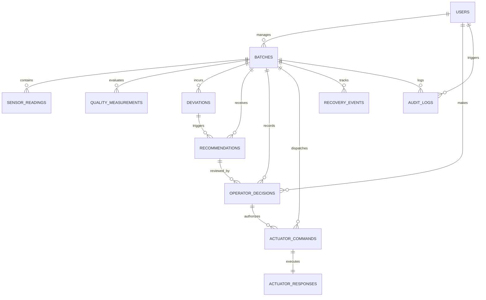

# BatchSaver Database Design & ER Architecture

## 1. Overview
BatchSaver uses PostgreSQL 16 as its relational, transactional, and time-series datastore. The schema is organized into three major tiers:
1. **Core Process & Genealogy**: `batches`, `users`
2. **High-Frequency Telemetry & Quality States**: `sensor_readings`, `quality_measurements`, `deviations`
3. **Control & Traceability Events**: `recommendations`, `operator_decisions`, `actuator_commands`, `actuator_responses`, `recovery_events`, `audit_logs`

## 2. Entity Relationship Overview

## 3. High-Frequency Indexing Strategy
- `sensor_readings(batch_id, parameter, timestamp DESC)` for fast chart slicing.
- `deviations(batch_id, active)` for instantaneous open deviation lookups.
- `audit_logs(batch_id, timestamp DESC)` for rapid regulatory export.
