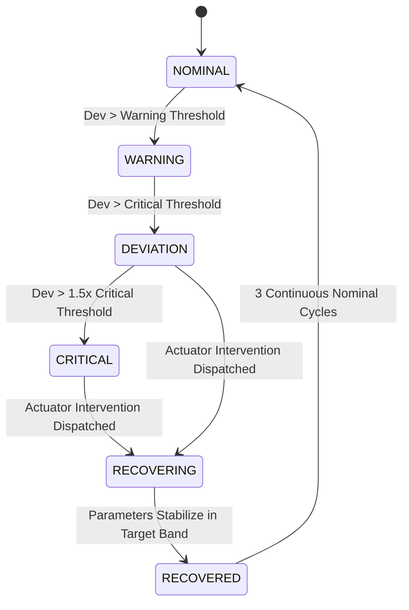

# Module 2: Quality Monitoring Engine

## 1. Overview & Purpose
Module 2 evaluates real-time raw and filtered sensor telemetry against product recipes and tolerance bands. It determines current quality states, triggers warnings, and calculates the overall **Batch Health Score (0-100)**.

## 2. Six-State Quality FSM (Finite State Machine)

## 3. Batch Health Score Algorithm
The composite score is weighted based on the physical dynamics of wet masala:
- **Viscosity**: 35% weight
- **Moisture**: 30% weight
- **Temperature**: 20% weight
- **Colour Index**: 15% weight

Score calculation penalizes deviations non-linearly to emphasize early intervention before the batch reaches irreversible degradation.

## 4. Implementation Roadmap (Batch 03 & 04)
- Build mathematical state classifier.
- Implement exponential moving average (EMA) noise filtering.
- Implement trend and drift slope detection.
